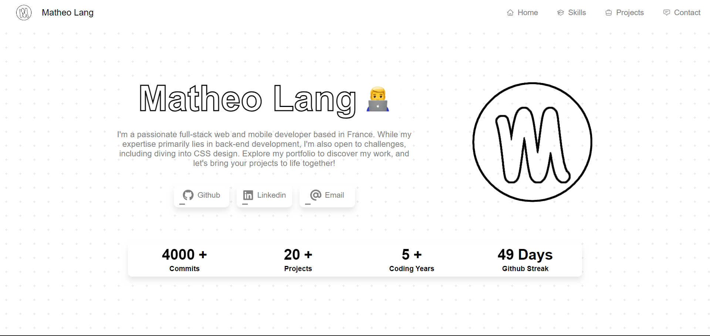

# Portfolio using NextJS and SCSS

Website [Link](https://matsuel.netlify.app) here check it now

## Look of this amazing simplist template

Here is the 4th version of my portfolio creating using NextJS and SCSS, the previous versions were no longer to my tastes and were a little outdated in terms of design. On this version I focused on simplicity in order to create a template that would suit me better. This template was created by me while taking up the idea of ​​an "eco-friendly" site based on the site of [Niji](https://www.niji.fr/fr/).
What I really liked about this site was the simplicity of the design which I find super clean.